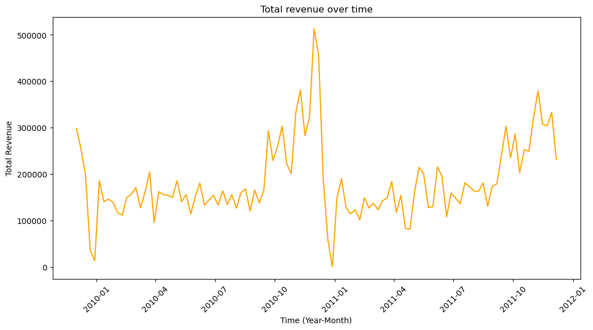
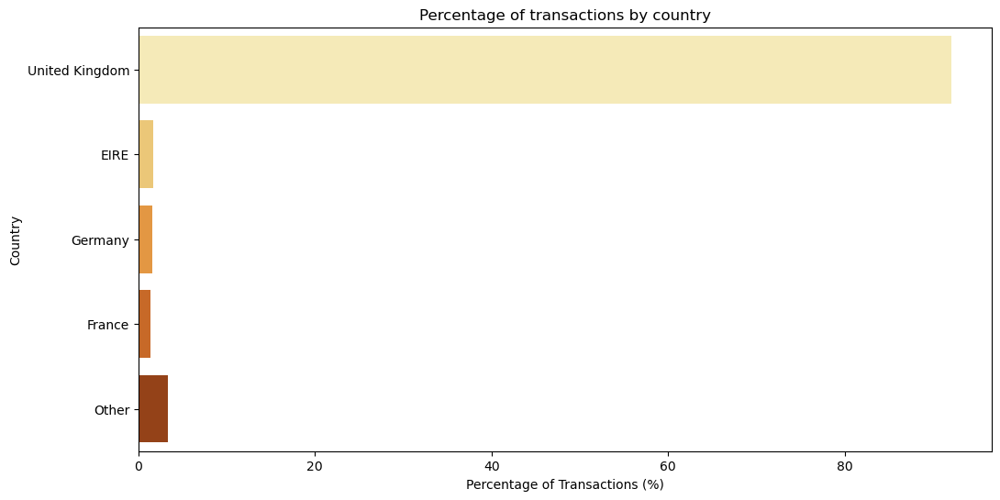

# 📈 数据分析流程概览

本项目采用完整的数据分析流程，展示了如何从原始交易数据中提取洞察并提出运营建议。

数据准备包括以下三个阶段：

---

## 1️⃣ 数据收集

- 来源：[UCI Machine Learning Repository - Online Retail II](https://archive.ics.uci.edu/dataset/502/online+retail+ii)
- 数据范围：2009年12月1日至2011年12月9日
- 总记录数：1,067,371 条
- 字段包括：Invoice, StockCode, Description, Quantity, InvoiceDate, UnitPrice, CustomerID, Country

---

## 2️⃣ 数据整理（清洗 + 结构化）

- ✅ **处理缺失值**：如 customer_id、description 缺失
- ✅ **数据类型转换**：InvoiceDate 转换为 datetime，CustomerID 转换为整数，Country 转为分类变量
- ✅ **异常值识别与剔除**：
  - Invoice 以 “C” 开头的为退货单
  - Price=0 或 Quantity<0 的交易作为异常处理
- ✅ **构造字段**：增加 invoice_amount（单价 × 数量）
- ✅ **字段标准化**：统一字段命名风格（如小写 + 下划线）

---

## 3️⃣ 探索性数据分析（EDA）

- 📊 **描述性统计**：平均交易金额、单价、数量的分布

- 📉 **时间趋势分析**：
  - 年末订单与金额激增
  - 每年出现一致的季节性波动

- 🌍 **地理分布**：90% 销售发生在英国

- 🧃 **商品分析**：
  - 商品种类丰富但集中度低
  - 单价低、销量高的商品为主

---

公司的主要客户为批发商，主要商品为节日礼品。考虑到这些经营特点，本项目在完成数据准备后分别从商品角度和客户角度分别建立模型进行分析。
