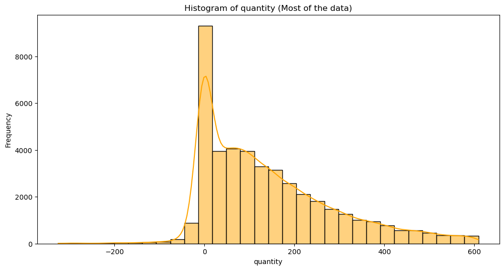
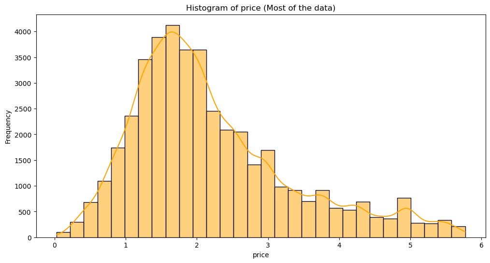
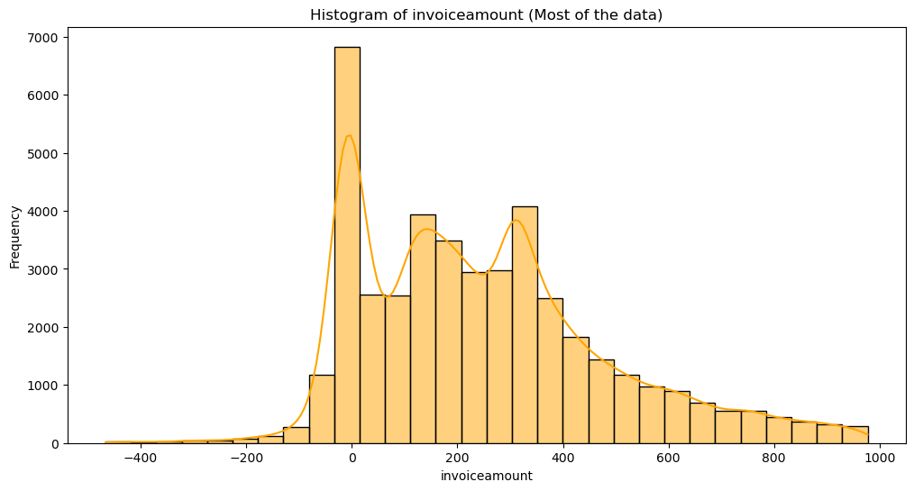

# 📈 数据分析流程概览

本项目采用完整的数据分析流程，展示了如何从原始交易数据中提取洞察并提出运营建议。包括以下五个阶段：

---

## 1️⃣ 数据收集

- 来源：[UCI Machine Learning Repository - Online Retail II](https://archive.ics.uci.edu/dataset/502/online+retail+ii)
- 数据范围：2009年12月1日至2011年12月9日
- 总记录数：1,067,371 条
- 字段包括：Invoice, StockCode, Description, Quantity, InvoiceDate, UnitPrice, CustomerID, Country

---

## 2️⃣ 数据整理（清洗 + 结构化）

- ✅ **处理缺失值**：如 customer_id、description 缺失
- ✅ **数据类型转换**：InvoiceDate 转换为 datetime，CustomerID 转换为整数，Country 转为分类变量
- ✅ **异常值识别与剔除**：
  - Invoice 以 “C” 开头的为退货单
  - Price=0 或 Quantity<0 的交易作为异常处理
- ✅ **构造字段**：增加 invoice_amount（单价 × 数量）
- ✅ **字段标准化**：统一字段命名风格（如小写 + 下划线）

---

## 3️⃣ 探索性数据分析（EDA）

- 📊 **描述性统计**：平均交易金额、单价、数量的分布

单价分布

数量分布

交易金额分布

- 📉 **时间趋势分析**：
  - 年末订单与金额激增
  - 每年出现一致的季节性波动
- 🌍 **地理分布**：90% 销售发生在英国
- 🧃 **商品分析**：
  - 商品种类丰富但集中度低
  - 单价低、销量高的商品为主

---

## 4️⃣ 建模分析（客户与商品角度）

- 👥 **客户价值分析**：使用 RFM 模型评估客户重要性
- 🔁 **客户留存预测**：构建 Cohort 留存矩阵 + 热力图
- 📈 **销售趋势预测**：对最热销商品使用 SARIMAX 预测下一年销售量
  - 外生变量：节假日
  - 季节性周期：52 周
  - 模型性能指标：RMSE, 可视对比预测趋势

---

## 5️⃣ 洞察与建议总结

- 🧲 提升客户粘性：抓住新客户加入窗口期
- 🧠 拓展高价值客户：对潜力客户进行精准推荐
- 📦 商品优化：开发高附加值商品、建立差异化定价
- 📊 运营策略：淡季促销，旺季备货；动态库存管理
- 📌 数据驱动反馈：利用模型不断优化销售预测

---

本流程确保了从原始数据到可执行建议的完整闭环，展示了数据分析师在业务问题上的全流程能力。
